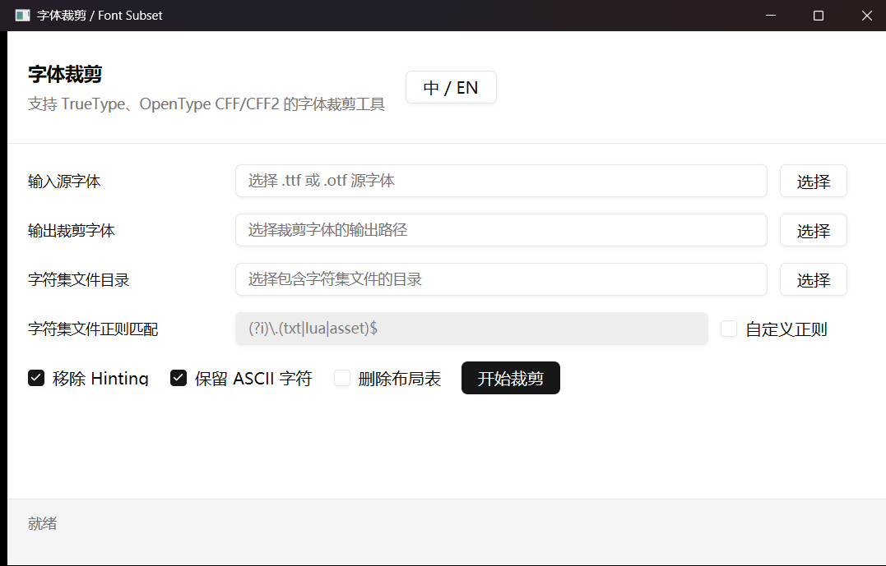

# FontSubset

English | [中文](README.md)

A desktop font subsetter written in Rust with
[HarfBuzz Subset](https://harfbuzz.github.io/harfbuzz-hb-subset.html),
[GPUI](https://github.com/zed-industries/zed/tree/main/crates/gpui), and
[GPUI Component](https://github.com/longbridge/gpui-component). PostScript
outlines are subset directly and are never converted to TrueType.

## Features

- Supports `.ttf` and `.otf` files
- Supports TrueType `glyf` outlines
- Supports PostScript CFF, CID-keyed CFF, and variable CFF2 outlines
- Recursively scans character-source directories using a configurable regex
- Can retain visible ASCII characters and remove TrueType hinting
- Preserves complex layout tables such as `GSUB`, `GPOS`, and `GDEF` by default
- Strictly verifies that the output cmap contains only requested characters
  supported by the source font
- The GUI and console share the same `fontsubset-core` implementation
- The GUI supports live Chinese/English switching and runs subsetting on a
  background thread

Standalone Type 1 `.pfa` and `.pfb` files are not OpenType fonts and are not
accepted directly. Convert them to OpenType CFF first. OpenType CFF/CFF2 fonts
are subset directly without conversion to TTF.

## Screenshot



## GUI Usage

1. Select an input `.ttf` or `.otf` font.
2. Select the output font path.
3. Select a directory containing character-source files.
4. Configure custom regex, ASCII retention, hint removal, or layout removal.
5. Click **Start Subset**.

Use **中 / EN** in the header to switch languages. Layout tables remain enabled
unless **Drop Layout Tables** is explicitly selected.

## Console Usage

Collect characters from matching files in a directory:

```shell
fontsubset-console -c examples/input_text -a examples/IMPACT.TTF output.ttf
```

Subset from literal text:

```shell
fontsubset-console --text "Hello, world" input.otf output.otf
```

The legacy option names `--charsfile` and `--strip` remain available. Use `-s`
or `--strip-hints` to remove TrueType hinting, and `--drop-layout` to explicitly
remove layout tables.

## Self-contained HarfBuzz

HarfBuzz 11.2.0 Subset is compiled statically from vendored source into both
the GUI and console. Windows, Linux, and macOS users do not need to install
HarfBuzz, copy a DLL, or configure an environment variable. Each executable is
about 2 MB larger, but release packages no longer depend on the system
HarfBuzz version.

## Build

A stable Rust toolchain with Rust 2024 edition support is required. Windows
builds require MSVC and the Windows SDK. The first build downloads GPUI/Zed Git
dependencies and may take a while.

```shell
cargo build --release --workspace
```

Outputs:

```text
target/release/fontsubset-console.exe
target/release/fontsubset-gui.exe
```

Run the GUI:

```shell
cargo run -p fontsubset-gui
```

## Architecture

```text
src/
  harfbuzz-subset-sys/  # Static HarfBuzz Subset FFI and C++ build
  fontsubset-core/       # Character collection, HarfBuzz subset, validation
  fontsubset-console/    # Command-line frontend
  fontsubset-gui/        # GPUI frontend and zh/en resources
legacy/                  # Previous C#/Avalonia implementation and build files
examples/                # Example font and character-source files
vendor/harfbuzz/         # Pinned HarfBuzz 11.2.0 source and license
```

## Tests

```shell
cargo fmt --all -- --check
cargo test --locked --workspace
cargo clippy --locked --workspace --all-targets -- -D warnings
```

The implementation has been tested with real TrueType, CFF, CID-keyed CFF,
and variable CFF2 fonts.

## Release

Pushing a `v*` tag triggers GitHub Actions to build Windows, Linux, and macOS
archives, generate SHA-256 checksum files, and publish a GitHub Release. The tag
must match the workspace version in the root `Cargo.toml`.

```shell
git tag v0.1.0
git push origin v0.1.0
```

The GUI and console are published as separate downloads:

- `fontsubset-gui-windows-x64.zip`
- `fontsubset-console-windows-x64.zip`
- `fontsubset-gui-linux-x64.tar.gz`
- `fontsubset-console-linux-x64.tar.gz`
- `fontsubset-gui-linux-arm64.tar.gz`
- `fontsubset-console-linux-arm64.tar.gz`
- `fontsubset-gui-macos-arm64.zip`
- `fontsubset-console-macos-arm64.tar.gz`

The macOS GUI archive contains a standard `FontSubset.app` with an ad-hoc code
signature, but it is not signed with an Apple Developer ID or notarized. If
Gatekeeper blocks the first launch,
try right-clicking the app and selecting **Open**, or run:

```shell
xattr -dr com.apple.quarantine FontSubset.app
open FontSubset.app
```

`xattr -cr FontSubset.app` also works, but removes all extended attributes.
Removing only `com.apple.quarantine` is more precise. Warning-free downloaded
apps still require Developer ID signing and Apple notarization.

## License

[MIT](LICENSE)
