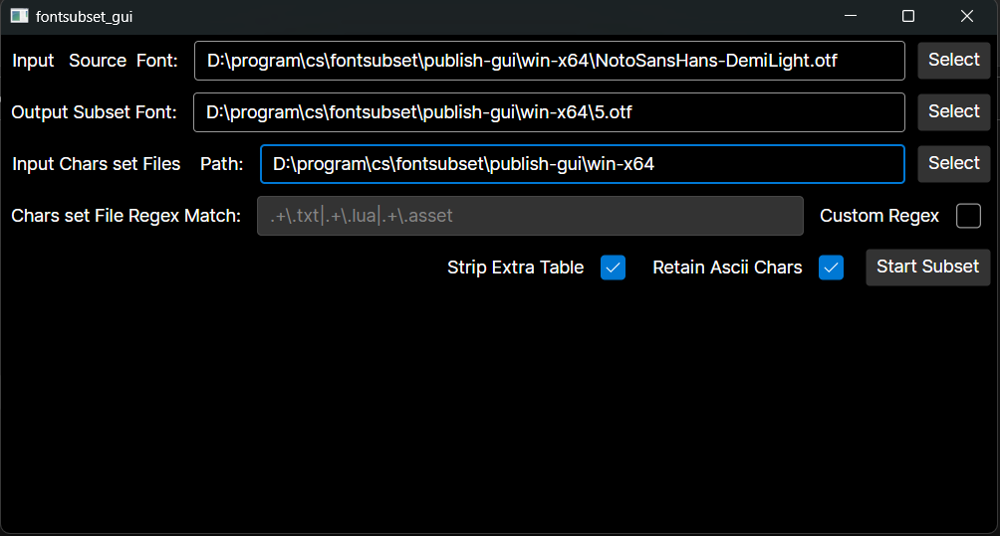
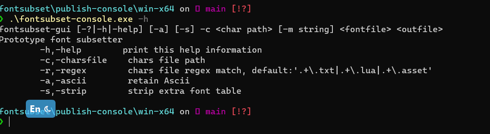

# fontsubset

# 介绍

font subset pruner，字体瘦身裁剪工具，保留指定的字符，支持otf，ttf。使用.net6+Avalonia开发的跨平台GUI+Console程序，无需安装环境，直接到[Github Release](https://github.com/821869798/fontsubset/releases)下载程序运行即可运行，有Console和GUI两种程序。

>  使用举例：游戏开发中字体文件一般都很大，但是热更新之前需要使用字体，但是一般字体也是走ab热更，所以跟包走一般不仅冗余而且加载也慢。这时候可以根据热更界面涉及的文字，裁剪一份很小的字体使用。

# 使用介绍

## GUI使用

- `Input Source Font` 需要裁剪的字体文件
- `Output Subset Font` 裁剪完输出的字体文件路径
- `Input Chars set Files` 字符集文件，收集这个目录下的文件中的字符，然后裁剪字体时保留这些字符。
- `Chars set File Regex Match` 收集字符集文件的正则匹配，开启Custom Regex的Toggle开关后可以自定义
- `Strip Extra Table` 剔除字体文件中不必要的table
- `Retain Ascii Chars` 保留基础的ascii码符号

## Console命令行程序使用

使用 fontsubset-console -c <字符集目录> -r <字符集文件匹配规则> -a -s <输入字体文件> <输出的字体文件> 

# Credits

**[sfntly.net](https://github.com/Dogwei/sfntly.net)** 